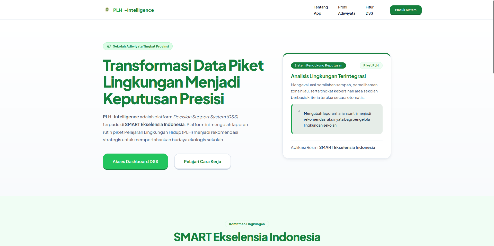
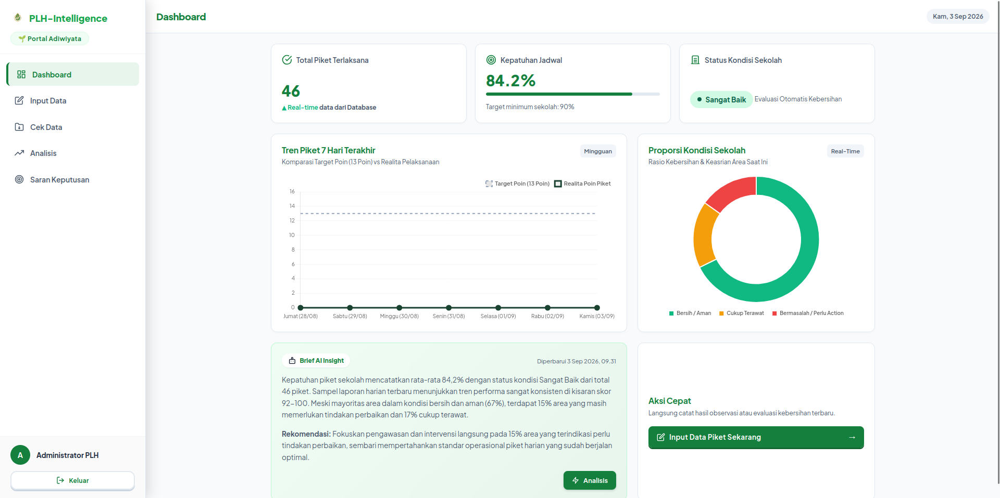
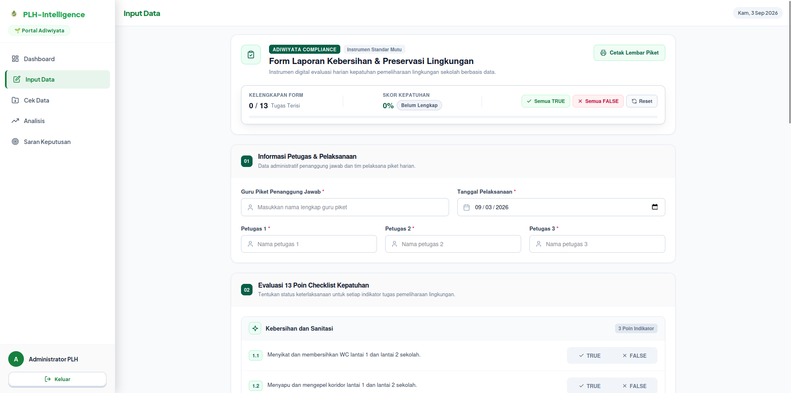
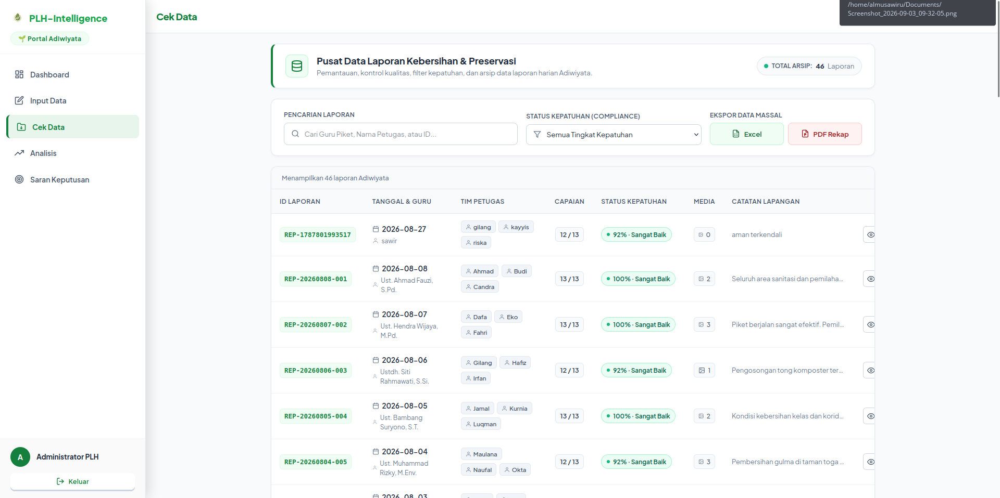
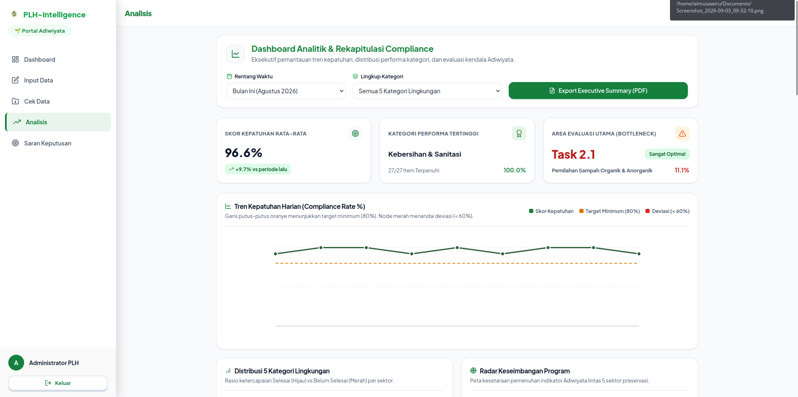
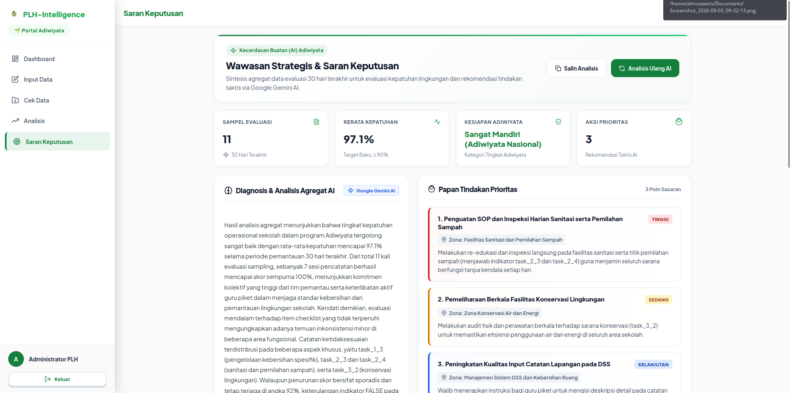
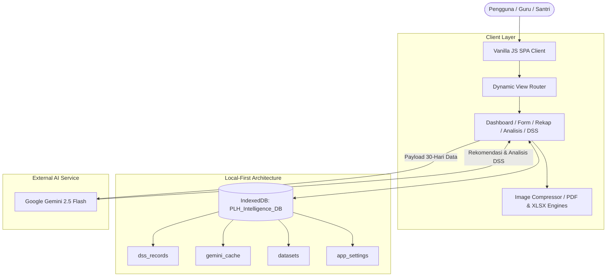
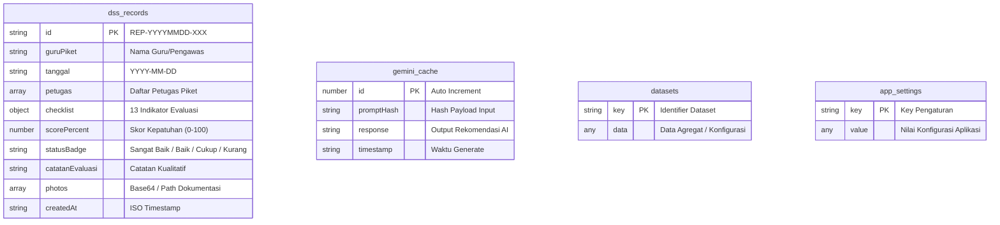

<div align="center">  
    
  # PLH-Intelligence   
  ### Data Tepat, Aksi Cepat, Lingkungan Terawat  
    
  [](https://plh-intelligence.netlify.app/)  
  [](https://github.com/projekapp4-hub/plh-intelligence)  
  [](LICENSE)  
    
  **Submission for ITECHNO CUP 2026 - Web Development**  
    
  **By SMAS SMART Ekselensia Indonesia**  
    
</div>

---

## 📋 Daftar Isi

- [Tentang Proyek](#-tentang-proyek)  
- [Fitur Unggulan](#-fitur-unggulan)  
- [Demo & Screenshot](#-demo--screenshot)  
- [Teknologi](#-teknologi)  
- [Arsitektur Sistem](#-arsitektur-sistem)  
- [Instalasi & Setup](#-instalasi--setup)  
- [Penggunaan](#-penggunaan)  
- [API Documentation](#-api-documentation)  
- [Testing](#-testing)  
- [Tim Developer](#-tim-pengembang)  
- [Lisensi](#-lisensi)

---

## 👥 Tim Developer

| Nama | Peran | GitHub |  
|------|-------|--------|  
| **Al Musawiru** | Project Lead & Full Stack Developer | [GitHub](https://github.com/projekapp4-hub/) |  
| **Gilang Al Farizi Khasafi** | UI/UX designer | Kosong|  
| **Mujahid Kayyis** | Software Tester | Kosong|  

---

## 🎯 Tentang Proyek

### Latar Belakang

Pencatatan piket dan kebersihan di lingkungan sekolah umumnya masih dilakukan secara manual menggunakan kertas. Metode konvensional ini rentan terhadap kehilangan lembar data, kerusakan fisik, serta menyulitkan proses rekapitulasi dan evaluasi berkala saat arsip catatan mulai menumpuk.

### Solusi yang Ditawarkan

**PLH-Intelligence** mendigitalkan seluruh alur pencatatan dan rekapitulasi data piket secara real-time dan terorganisir. Aplikasi ini juga dilengkapi integrasi AI serta fitur *Decision Support System* (DSS) untuk menganalisis data kebersihan secara otomatis dan memberikan rekomendasi evaluasi yang tepat.

### Tujuan Proyek

- 🎯 **Tujuan Utama**: Menyediakan platform digital praktis untuk pencatatan, rekapitulasi otomatis, dan analisis evaluasi piket kebersihan lingkungan.
- 📊 **Target Pengguna**: Pihak sekolah (guru, koordinator piket, staf, siswa) serta instansi pendidikan atau organisasi yang mengelola kebersihan berkala.
- 💡 **Value Proposition**: Rekapitulasi instan bebas kertas yang dipadukan dengan DSS dan analitik cerdas untuk mempermudah pengambilan keputusan.

---

## ✨ Fitur Unggulan

### Fitur Utama

| Fitur | Deskripsi | Keunggulan |  
|----------|--------------|---------------|  
| **Pencatatan Piket & Rekap Online** | Input formulir piket berbasis 13 indikator Adiwiyata (5 kategori) secara digital dan terpusat. | Bebas kertas (*paperless*), data otomatis tersimpan di Database secara terstruktur dan aman. |  
| **Decision Support System (DSS) AI** | Analisis evaluasi kebersihan cerdas berbasis agregat 30 hari menggunakan Gemini AI. | Memberikan rekomendasi tindakan preventif, skor kepatuhan, dan identifikasi area kritis secara objektif. |  
| **Ekspor PDF (Per Piket & Massal)** | Cetak laporan formal berformat PDF baik per entri piket tunggal maupun rekapitulasi data massal. | Layout rapi, siap cetak untuk arsip sekolah dengan sanitasi teks otomatis via `jspdf`. |  
| **Ekspor Data Spreadsheet (Excel)** | Unduh seluruh rekapitulasi data laporan kebersihan ke dalam format `.xlsx`. | Memudahkan analisis lanjutan dan pengolahan data administratif menggunakan `exceljs`. |  
| **Cetak Lembar Form Piket Kosong** | Fitur cetak format formulir blangko fisik siap pakai langsung dari aplikasi. | Fleksibel digunakan sebagai cadangan saat dibutuhkan pencatatan luring di lapangan. |  

### Fitur Tambahan

- **Visualisasi Data & Tren Interaktif** - Grafik kepatuhan harian dan distribusi kategori kebersihan secara visual menggunakan `Chart.js`.
- **Kompresi Gambar Otomatis di Klien** - Optimasi ukuran foto dokumentasi piket sebelum disimpan menggunakan `browser-image-compression` agar efisien memori.
- **Antarmuka Responsif & Modern** - Desain SPA (*Single Page Application*) Vanilla JS dengan sistem ikon SVG semantik yang ringan dan bersih.

---

## 📸 Demo & Screenshot

### Live Demo

🔗 **[Kunjungi Website](https://plh-intelligence.netlify.app/)**

### Screenshot Aplikasi

<div align="center">  
    
  <p><em>Homepage - Tampilan utama aplikasi</em></p>  
    
    
  <p><em>Dashboard - Panel kontrol dan ringkasan statistik</em></p>  
    
    
  <p><em>Input Data - Formulir pencatatan piket kebersihan</em></p> 
  
    
  <p><em>Rekap Data - Riwayat laporan dan ekspor dokumen</em></p>  

    
  <p><em>Analisis Berkala - Tren dan grafik performa kebersihan</em></p>  

    
  <p><em>DSS AI - Rekomendasi dan evaluasi cerdas</em></p>   
</div>

### Video Demo

📹 **[Link Video Demo](https://drive.google.com/file/d/1mJ_dNP-68NWdAIWv_HYY3yvFTr5RNJIR/view?usp=sharing)**

---

## 🛠️ Teknologi

### Tech Stack

#### Frontend  
```  
Architecture : Vanilla JavaScript (SPA & Dynamic View Router)  
Bundler      : Vite  
Styling      : Modern CSS3 (Variables, Flexbox & Grid)  
Visualisasi  : Chart.js  
AI Engine    : Google Generative AI (@google/genai - Gemini 2.5 Flash)  
Dokumen      : jsPDF (PDF Engine) & ExcelJS (Spreadsheet Engine)  
Optimasi     : browser-image-compression  
Storage      : IndexedDB (Client-side Persistent Storage)  
```

#### DevOps & Tools  
```  
Platform     : Netlify  
Version Ctrl : Git & GitHub  
Dev Server   : Netlify CLI & Vite Dev  
```

### Alasan Pemilihan Teknologi

| Teknologi | Alasan Pemilihan |  
|-----------|------------------|  
| **Vanilla JS (SPA Architecture)** | Eksekusi instan tanpa beban runtime framework, menjaga ukuran bundel tetap minimal dan responsif di berbagai spesifikasi perangkat. |  
| **IndexedDB (Local-First Storage)** | Menjamin akses data penuh secara *offline-first*, latensi *read/write* instan tanpa *round-trip* jaringan, serta menjamin privasi data internal sekolah tetap di peranti pengguna. |  
| **Google Generative AI (Gemini 2.5 Flash)** | Kecepatan inferensi tinggi dan token efisien untuk pemrosesan analisis DSS berbasis tren kebersihan 30 hari secara real-time. |  
| **Vite** | *Build tool* modern dengan *Hot Module Replacement* (HMR) cepat dan optimasi bundling ES modules yang ringkas untuk produksi. |  
| **jsPDF & ExcelJS** | Pembuatan berkas laporan PDF dan spreadsheet langsung di sisi klien (*client-side export*) tanpa membebani komputasi server. |  
| **browser-image-compression** | Mereduksi ukuran file dokumentasi foto piket sebelum disimpan ke IndexedDB untuk efisiensi ruang penyimpanan lokal. |

### Dependencies Utama

```json  
{  
  "dependencies": {  
    "@google/genai": "^2.15.0",  
    "browser-image-compression": "^2.0.2",  
    "chart.js": "^4.5.1",  
    "exceljs": "^4.4.0",  
    "jspdf": "^4.2.1"  
  },  
  "devDependencies": {  
    "netlify-cli": "^27.3.0",  
    "vite": "^8.2.0"  
  }  
}  
```

---

## 🏗️ Arsitektur Sistem

### System Architecture



### Database Schema (IndexedDB)



### Folder Structure

```  
plh-intelligence/  
├── foto/                   # Aset tangkapan layar dokumentasi  
├── public/                 # Favicon dan SVG sprite  
├── src/  
│   ├── api/                # Integrasi Google Generative AI (gemini.js)  
│   ├── assets/             # Dokumentasi gambar & logo  
│   ├── pages/              # Halaman utama aplikasi  
│   │   ├── dashboard/      # Orkestrator SPA & sub-views (form, rekap, analisis, dss)  
│   │   ├── landing/        # Halaman muka (landing page)  
│   │   └── login/          # Halaman otentikasi  
│   ├── style/              # CSS global dan komponen UI  
│   └── utils/              # Storage (IndexedDB), Auth, PDF/Excel generator, Kompresi  
├── index.html              # Entry point utama aplikasi  
├── package.json            # Konfigurasi dependensi dan scripts  
└── vite.config.js          # Konfigurasi bundler Vite  
```

---

## ⚙️ Instalasi & Setup

### Prerequisites

Pastikan perangkat telah terpasang:  
- **Node.js** (v18.x, v20.x, v22.x atau LTS terbaru)  
- **npm** (bawaan Node.js)  
- **Git**

### Langkah Instalasi

#### 1️⃣ Clone Repository

```bash  
git clone https://github.com/projekapp4-hub/plh-intelligence.git  
cd plh-intelligence  
```

#### 2️⃣ Install Dependencies

```bash  
npm install  
```

#### 3️⃣ Setup Environment Variables

Buat berkas `.env` di root directory:

```env  
GEMINI_API_KEY=your_gemini_api_key_here
```

#### 4️⃣ Run Development Server

```bash  
# Menjalankan frontend Vite + Netlify Functions (direkomendasikan)
npm run dev:netlify
# Server aktif di http://localhost:8888

# Atau menjalankan Vite dev server saja
npm run dev
# Server aktif di http://localhost:3000
```

#### 5️⃣ Build & Production

```bash  
npm run build
```

---

## 🚀 Penggunaan

### Kredensial Pengujian (Demo Login)

| Role | Username | Password | Akses |
|---|---|---|---|
| **Admin / Pengawas PLH** | `admin` | `admin` | Akses penuh dashboard, form piket, rekap data, analisis grafik, & DSS AI |

### Alur Penggunaan Fitur

1. **Autentikasi & Masuk**: Buka aplikasi, login menggunakan kredensial di atas untuk masuk ke dashboard utama.
2. **Input Laporan Piket**: Pilih menu **Input Data**, isi 13 indikator Adiwiyata, unggah foto dokumentasi, dan simpan laporan (otomatis tersimpan ke IndexedDB).
3. **Rekap & Ekspor Laporan**: Buka menu **Rekap Data** untuk meninjau riwayat laporan, cetak PDF per laporan/massal, atau unduh rekapitulasi format Excel (`.xlsx`).
4. **Monitoring Berkala**: Buka menu **Analisis Berkala** untuk melihat grafik tren kepatuhan kebersihan harian/bulanan via Chart.js.
5. **Analisis DSS AI**: Buka menu **DSS AI**, tekan tombol analisis untuk menghasilkan evaluasi berbasis agregat 30 hari dan rekomendasi tindakan dari Gemini 2.5 Flash.

---

## 📚 API Documentation

Aplikasi ini menggunakan **Serverless Function** sebagai reverse-proxy ke Google Gemini API guna mengamankan API key agar tidak terekspos di sisi klien.

### Endpoint

```http  
POST /api/gemini  
```

### Action Types

#### 1. `analyzeJSON` (Analisis Terstruktur DSS)
Mengirimkan data rekap piket 30 hari dalam format JSON untuk dianalisis oleh Gemini AI dengan skema output terstruktur.

```javascript  
const response = await fetch('/api/gemini', {  
  method: 'POST',  
  headers: { 'Content-Type': 'application/json' },  
  body: JSON.stringify({  
    action: 'analyzeJSON',  
    jsonData: aggregatedReports,  
    promptInstruction: 'Evaluasi tren kepatuhan dan berikan rekomendasi aksi preventif.',  
    jsonSchema: dssOutputSchema,  
    modelName: 'gemini-3.6-flash'  
  })  
});  
const { result } = await response.json();  
```

#### 2. `analyzeText` (Analisis Teks Bebas)
Mengirimkan prompt teks untuk analisis naratif atau evaluasi kualitatif cepat.

```javascript  
const response = await fetch('/api/gemini', {  
  method: 'POST',  
  headers: { 'Content-Type': 'application/json' },  
  body: JSON.stringify({  
    action: 'analyzeText',  
    promptText: 'Buatkan ringkasan evaluasi kebersihan sekolah pekan ini.',  
    systemInstruction: 'Anda adalah konsultan kebersihan lingkungan sekolah Adiwiyata.'  
  })  
});  
const { result } = await response.json();  
```

---

## 🧪 Testing

Pengujian aplikasi berfokus pada **Black-box Testing**, **Cross-Browser Verification**, dan **User Scenario Simulation** yang dilakukan langsung oleh tim Software Tester (**Mujahid Kayyis**).

### Hasil Pengujian Fungsional

| Modul Pengujian | Skenario | Hasil | Status |
|---|---|---|:---:|
| **Autentikasi** | Login akun admin & validasi kredensial | Sesi tersimpan & route guard aktif | ✅ Pass |
| **Input & IndexedDB** | Input 13 indikator + upload foto & simpan | Data & base64 foto tersimpan di `dss_records` | ✅ Pass |
| **Ekspor Laporan** | Cetak PDF (single & massal) & Excel `.xlsx` | Dokumen terunduh rapi tanpa distorsi | ✅ Pass |
| **Visualisasi Tren** | Render chart 30 hari via Chart.js | Grafik responsif & kalkulasi skor akurat | ✅ Pass |
| **DSS AI Engine** | Kirim agregat 30 hari ke endpoint Netlify Function | Rekomendasi terstruktur diterima & dirender | ✅ Pass |
| **Offline Mode** | Navigasi & input data tanpa koneksi internet | Aplikasi & IndexedDB berfungsi penuh | ✅ Pass |

---

## 📄 Lisensi

Proyek ini dilisensikan di bawah [MIT License](LICENSE) - lihat file LICENSE untuk detail lebih lanjut.

---

<div align="center">

  **Made with ❤️ by [Nama Tim] for ITECHNO CUP 2026**

    
</div>  
